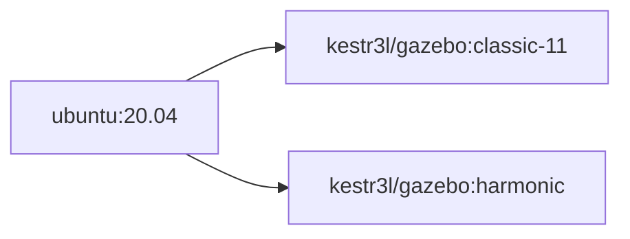

# CONTAINERIZED GAZEBO CLASSIC CONTAINER FOR PX4 SITL

## 0. OVERVIEW

- This repository contains resources for building Gazebo Container for running PX4-Autopilot SITL
- Gazebo-Classic does not support recent versions of Ubuntu newer than 20.04 Focal Forsa.
- Application packed as a docker container can help overcome this issue.
- Container built from this repository also contains [GazeboDrone](https://microsoft.github.io/AirSim/gazebo_drone/) for integrating AirSim Simulation.
- Prebuilt image is available on [docker hub](https://hub.docker.com/r/kestr3l/gazebo).

## 1. AVAIABLE TAGS & BUILD ORDERS

### 1.1. TAG NAMEING RULES

|TAG|DESCRIPTION|Example|Misc.|
|:-|:-|:-|:-|
|`<version>`|Gazebo containers including resources required to run PX4 SITL|`gazebo-classic-11`|-|

### 1.2. IMAGE AVAILABILITY

|TAG|ARCH|AVAILABILITY|Misc.|
|:-|:-|:-:|:-|
|`harmonic`|AMD64|✅|Build resource managed by:<br/>[kestr3l/Gazebo-PC4-Container](https://github.com/kestr31/Gazebo-PX4-Container)|
|`classic-11`|AMD64|✅|-|

### 1.3. BUILD ORDERS




## 2. ENVIRONMENT VARIABLE & VOLUME/DEVICE MAPPING SETUPS

### 2.1. ENVIRONMENT VARIABLE SETTINGS LIST

|VAR|DESCRIPTION|EXAMPLE|Misc.|
|:-|:-|:-|:-|
|`DISPLAY`|Host wayland display environment variable<br/>(Optional if `HEADLESS=1`)|`:0`|Required only for X-Window system|
|`WAYLAND_DISPLAY`|Host wayland display environment variable<br/>(Optional if `HEADLESS=1`)|`wayland-0`|Required only for Wayland system|
|`SITL_TYPE`|Variable for checking PX4 SITL run validity|`gazebo-classic`|Shared with PX4 container|
|`SITL_AIRFRAME`|Airframe to simulate|`iris`|-|
|`SITL_WORLD`|SITL world to be used|`empty`|-|
|`PX4_HOME_LAT`|Home latitude of the airframe in SITL world|`37.384215`|Decimal|
|`PX4_HOME_LON`|Home longitude of the airframe in SITL world|`126.656648`|Decimal|
|`PX4_HOME_ALT`|Home altitude of the airframe in SITL world|`0.0`|meters|
|`ROS_DOMAIN_ID`|Index of ROS2 Network to be connected<br/>(Default: `0`)|`0`|-|
|`HEADLESS`|Headless(No Display) mode flag<br/>(Default: `0`)|`0`|`0` or `1`|
|`DEBUG_MODE`|Debug mode flag<br/>Gazebo will not run if enabled<br/>(Default: `0`)|`0`|`0` or `1`|
|`EXPORT_ENV`|Flag for exporting major environment variable in conatiner shell<br/>(Default: 1)|`1`|`0` or `1`|
|`AIRSIM_IP`|Accessible IP address of AirSim simulator for AirSim-Gazebo Integration<br/>(optional)|172.16.0.2|Ignored if not set|

### 2.2. VOLUME MAPPING SETTINGS LIST

|CONTAINER DIR|DESCRIPTION|HOST DIR EXAMPLE|Misc.|
|:-|:-|:-|:-|
|`tmp/.X11-unix`|Unix socket directory|`tmp/.X11-unix`|Recommend example value|
|`/usr/local/bin/entrypoint.sh`|Container entrypoint|`/home/user/entrypoint.sh`|Use for overriding|

### 2.3. DEVICE MAPPING SETTINGS LIST

|DEVICE|DESCRIPTION|EXAMPLE|Misc.|
|:-|:-|:-|:-|
|`/dev/dri/cardx`|Graphics device on Direct Rendering Interface<br/>(Optional)|`/dev/dri/cardx`|Check host system's value<br/>Use if video encoding/decoding is required|
|`/dev/dri/render12x`|DRM render node on Direct Rendering Interface<br/>(Optional)|`/dev/dri/render12x`|Check host system's value<br/>Use if video encoding/decoding is required|

## 3. HOW-TO-BUILD

```shell
DOCKER_BUILDKIT=1 docker build --no-cache \
--build-arg BASEIMAGE=ubuntu \
--build-arg BASETAG=20.04 \
-t kestr3l/gazebo:classic-11 \
-f ./Dockerfile .
```

## 4. ATTACHING CONTAINER TO SITL

### 4.1. RUN BY `docker compose` COMMAND

- Since there are many modular containers required to run PX4 SITL, deployment by `docker compose` is recommended.
- Configuration of `docker-compose.yml` will vary based on user's need.
- On this document, snippet for adding Gazebo-Classic deployment on `docker-compse.yml` is suggested.

```yaml
  sim:
    privileged: true
    environment:
      DISPLAY:                    :0
      WAYLAND_DISPLAY:            wayland-0
      SITL_TYPE:                  gazebo-classic
      SITL_AIRFRAME:              iris
      SITL_WORLD:                 empty
      PX4_HOME_LAT:               37.384215 
      PX4_HOME_LON:               126.656648
      PX4_HOME_ALT:               0.0
      ROS_DOMAIN_ID:              0
      HEADLESS:                   0
      DEBUG_MODE:                 0
      EXPORT_ENV:                 1
      # -------------------------------------------------
    volumes:
      - /tmp/.X11-unix
    devices:
      - /dev/dri/card0
      - /dev/dri/render128
    container_name:   gazebo-classic-container
    hostname:         gazebo-classic-container
    image:            kestr3l/gazebo:classic-11
    deploy:
      resources:
        reservations:
          devices:
            - driver: nvidia
              count: 1
              capabilities: [gpu]
``````

### 4.2. RUN BY `docker run` COMMAND (NOT RECOMMENDED)

> This container is designed to be deployed with other SITL components simulataneously using `docker compose` command.
> Running it by `docker run` command is only recommended for unit test or debugging purpose.

```shell
docker run -it --rm --gpus --all \
-e DISPLAY=${DISPLAY} \
-e WAYLAND_DISPLAY=${WAYLAND_DISPLAY} \
-e SITL_TYPE=gazebo-classic \
-e SITL_AIRFRAME=iris \
-e SITL_WORLD=empty \
-e PX4_HOME_LAT=37.384215 \
-e PX4_HOME_LON=126.656648 \
-e PX4_HOME_ALT=0.0 \
-v tmp/.X11-unix \
--name gazebo-classic-11 \
kestr3l/gazebo:classic-11 zsh
```